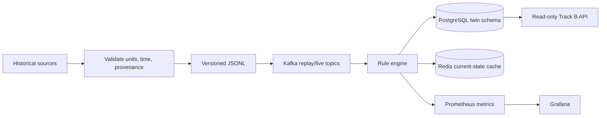

# Track B architecture

```mermaid
flowchart LR
  R[Historical sources] --> V[Validate units, time, provenance]
  V --> J[Versioned JSONL]
  J --> K[Kafka replay/live topics]
  K --> E[Rule engine]
  E --> P[(PostgreSQL twin schema)]
  E --> C[(Redis current-state cache)]
  E --> M[Prometheus metrics]
  M --> G[Grafana]
  P --> A[Read-only Track B API]
```

Replay and live are distinct source modes. Live ingestion is not enabled. Redis/Kafka/Prometheus/Grafana runtime is blocked pending confirmed image tags and local pulls.
